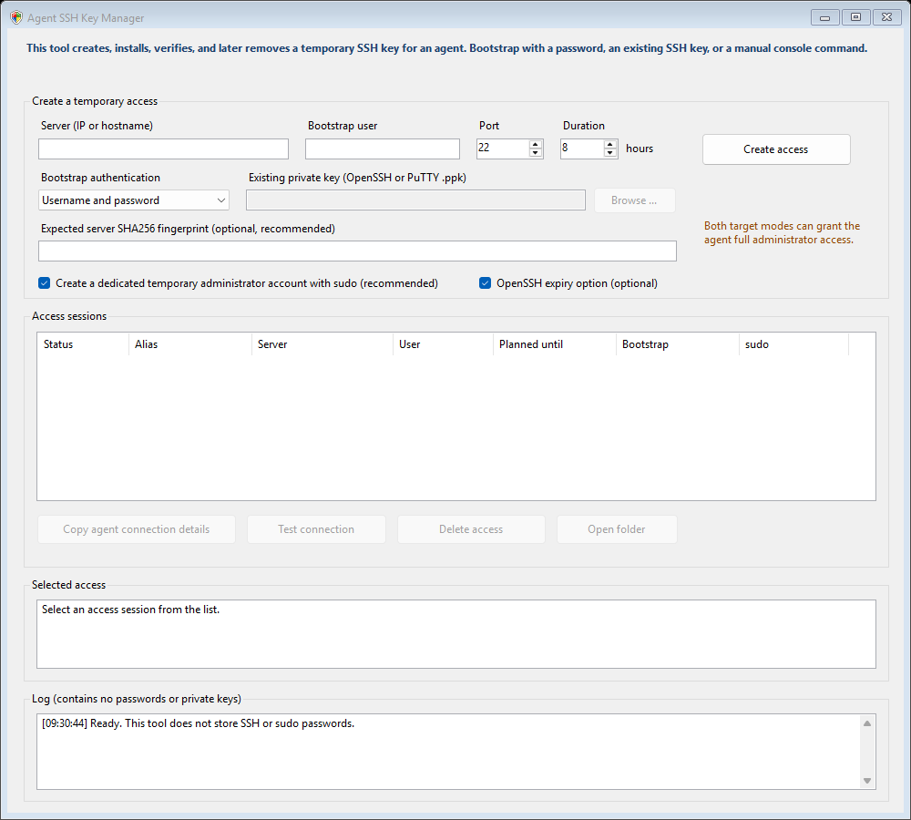

# Agent SSH Key Manager

[](https://github.com/svenreischauer/AgentSshKeyManager)
[](LICENSE)
[](https://github.com/svenreischauer/AgentSshKeyManager/releases)
[](https://github.com/svenreischauer/AgentSshKeyManager/stargazers)

Agent SSH Key Manager is a portable Windows tool for creating, installing, verifying, and later deleting temporary SSH access for an automation agent. The agent receives only a newly generated key—not the operator's password, private bootstrap key, or key passphrase.

Download the latest release from the [Releases page](https://github.com/svenreischauer/AgentSshKeyManager/releases). The EXE needs no installer. An unsigned build has no Authenticode publisher identity and may therefore be treated as untrusted by Windows or endpoint-security software; see [code signing](docs/CODE_SIGNING.md).

## Screenshot



## Bootstrap authentication

The bootstrap credential is used only to establish the first administrative connection and install the newly generated public key.

| Method | Use it when | Credential handling |
| --- | --- | --- |
| **Username and password** | The SSH server permits password or keyboard-interactive login. | Passwords are entered only in the separate Windows OpenSSH console. The application does not store or log them. |
| **Existing SSH key** | Password login is disabled but `PubkeyAuthentication` is available. OpenSSH/PEM keys and PuTTY `.ppk` files are supported, including passphrase-protected keys supported by the embedded library. | The selected key is opened read-only and used in memory by SSH.NET. Its path, contents, and passphrase are not written to the session metadata or given to the agent. A required sudo password is sent through the SSH command's standard input, never as a child-process argument. |
| **Manual installation** | Neither of the above can be used—for example, only a VM console or an already authenticated terminal is available. | The program displays the generated public key and a marker-scoped command that the operator runs manually. It then verifies the new access. |

The program does not recommend enabling SSH password authentication when a server intentionally disables it. Select **Existing SSH key** or **Manual installation** instead.

## Target modes and administrator access

### Dedicated temporary administrator account

This recommended mode creates an account such as `agentssh_a1b2c3d4e5`, gives it a separate `visudo`-validated rule under `/etc/sudoers.d/`, and grants unrestricted `sudo NOPASSWD`. It therefore grants the agent full administrator access.

A root-owned ownership marker under `/var/lib/agent-ssh-key-manager/` binds the generated account and its exact Ubuntu home directory to its session. Deletion refuses to remove an unrelated pre-existing account. Successful deletion stops the temporary user's processes and removes its home directory, SSH key, sudoers rule, ownership marker, and user account. If a partial external cleanup removed the account first, the manager still removes the session-owned home directory before confirming deletion.

### Existing user

This mode adds the temporary key to the selected user's `~/.ssh/authorized_keys`. Existing keys and the user's sudo configuration are preserved. A root account or an account that already has unrestricted sudo gives the agent full administrator access. If sudo still requires a password, the generated key alone does not make unattended sudo possible.

Both target modes can therefore provide complete control of the server. Use them only on systems for which you are authorized and only for the required duration.

## Normal workflow

1. Start `AgentSshKeyManager.exe`.
2. Enter the server/IP, bootstrap username, SSH port, and planned duration.
3. Select a bootstrap authentication method and a target mode.
4. Optionally enter an independently obtained SHA256 server fingerprint.
5. Click **Create access** and review the server host-key fingerprint in the combined setup confirmation. Verify it through a trusted channel before continuing.
6. Supply the selected bootstrap credential when prompted.
7. Wait until the newly generated login has been tested and is shown as active.
8. Select the session and click **Copy agent connection details**.
9. Give the agent only those generated details.
10. When the work is complete, click **Delete access**.

The copied details contain:

- a short instruction asking the agent to connect and confirm whether sudo rights are available;
- server/IP and port;
- temporary username;
- path to the generated temporary private key;
- confirmed server host-key fingerprint; and
- a ready-to-use SSH command.

An example command is:

```text
ssh.exe -F "C:\...\ssh_config" agent-ssh-a1b2c3d4e5
```

Nothing is copied automatically. The clipboard is used only after an explicit click on a copy button.
Hover over any label or control in **Create a temporary access** to see a short explanation of that field.

## Security design

- A separate Ed25519 key and cryptographically random session ID are generated for every access.
- The initial host-key exchange sends no password or private key. The detected SHA256 fingerprint appears in the same confirmation as the setup summary, avoiding a separate popup. Alternatively, supply an expected fingerprint so a mismatch is rejected automatically.
- The exact raw host key is pinned in memory for SSH.NET and in a session-specific `known_hosts` file for Windows OpenSSH.
- All subsequent SSH calls use strict host-key checking. `StrictHostKeyChecking=no` is never used.
- Hostnames, usernames, ports, fingerprints, stored records, and generated public-key files are validated before use.
- The server-side `authorized_keys` entry contains a unique `agent-ssh-access:<session-id>` marker.
- Existing-user deletion rewrites only lines carrying that exact marker; it never replaces the file with a newly generated file containing only the temporary key.
- Dedicated users receive an individually named, `visudo`-checked file under `/etc/sudoers.d/`.
- Installation failures trigger best-effort marker/account rollback. An unconfirmed rollback leaves the local key available and displays a manual cleanup command.
- A new login is marked ready only after an actual connection with the generated key succeeds.
- A cleanup is accepted only after the pinned server command verifies that this session's marked key or dedicated account artifacts are absent. Manual removal requires the operator to paste the command's session-bound confirmation line.
- After confirmed cleanup, the program also tests the generated login again. A still-working login prevents local key deletion; a timeout or other inconclusive follow-up does not override the server's verified cleanup postcondition.
- Generated private keys and sensitive session files receive NTFS access rules for the current Windows user and `SYSTEM`.

The generated private key is deliberately unencrypted so an automation agent can use it unattended. Treat it as a secret while the session is active; do not paste it into chat, email, source control, or tickets.

## Expiry

The duration is always recorded as a local planned end time. **OpenSSH expiry option** is enabled by default, so the program also adds an `expiry-time` restriction to the authorized key when the server supports it. An expiry blocks new logins but does not terminate an SSH session that is already open.

If the server rejects the optional expiry syntax, the program can roll back and retry without it. Always use **Delete access** when the work is complete, even when server-side expiry is enabled.

## Diagnostics

The UI distinguishes the most relevant setup failures, including:

- SSH password authentication disabled by the server;
- incorrect SSH password, as reported in the separate OpenSSH console;
- unsupported or malformed private-key format;
- missing or incorrect key passphrase;
- existing key rejected for the selected user;
- changed or unexpected server host key;
- login prohibited for the selected user;
- sudo unavailable, sudo rights missing, sudo password required, or sudo password rejected;
- failure to update `authorized_keys`; and
- failure to verify the newly generated login.

Detailed password-mode errors remain visible in the separate console until ENTER is pressed. They are not redirected into the GUI log because prompt and terminal behavior must remain interactive.

## Local data

Sessions are stored under:

```text
%LOCALAPPDATA%\AgentSshKeyManager\Sessions
```

`session.xml`, `ssh_config`, `known_hosts`, agent instructions, and the audit log contain no passwords, key passphrases, or bootstrap private-key contents. The bootstrap key path is not saved in a session. The generated temporary private key is the one intentional secret in its session directory.

The audit log records timestamps, constrained action names, process IDs, executable/payload hashes, and exit codes. It does not record raw remote commands or credentials. Non-secret session metadata remains as a local history after successful deletion; generated key material and connection config are deleted.

## Sophos and runtime process model

The application does not create temporary PowerShell scripts, start `powershell.exe`, or use `ExecutionPolicy Bypass`. Runtime operations are deliberately narrow:

- **Existing SSH key:** SSH.NET runs the bootstrap connection and remote command directly inside the application process.
- **Username and password:** the same EXE opens its constrained console mode and starts the Windows system `ssh.exe` directly so the operator can answer native password prompts.
- **Generated access:** the Windows system `ssh-keygen.exe` creates the temporary key; `ssh.exe` verifies and uses it.
- **Open folder:** Windows Explorer is started only after the user clicks the button.

This removes the behavior that caused the earlier `BrowserAncestorPowershell` detection. It is not a promise that every unsigned future build will be accepted by every security product. Authenticode signing, reproducible release handling, checksum verification, and testing under the actual endpoint policy remain important.

## Requirements

- Windows 10 or Windows 11;
- .NET Framework 4.6.2 or newer;
- Windows OpenSSH Client (`ssh.exe` and `ssh-keygen.exe`);
- network access to an OpenSSH server;
- a valid password, existing SSH key, or console/session for manual installation; and
- root or working sudo rights when creating a dedicated temporary administrator.

The EXE is portable and embeds its managed SSH dependencies. It does not install a Windows service and does not need PuTTY on the Windows computer to read `.ppk` files.

## Source layout

- `Program.cs` — application entry point, existing password/OpenSSH flow, session store, key generation, verification, and command builders.
- `MainFormBootstrap.cs` — additional authentication UI and workflow orchestration.
- `ExistingKeyBootstrap.cs` — SSH.NET host probing, private-key authentication, sudo handling, install/remove, and rollback.
- `BootstrapDialogs.cs` — credential and manual-fallback dialogs.
- `EmbeddedDependencyLoader.cs` — loads integrity-checked embedded assemblies without writing DLLs to a temporary directory.
- `Build.ps1` — maintainer-only build, signing, staging, dependency-hash verification, and self-test script.
- `tests/UbuntuAcceptanceHarness.cs` and `tests/ubuntu-lab/` — disposable Ubuntu/QEMU acceptance-test components; they are not compiled into the release EXE.

## Build, signing, and tests

Create a local, clearly named unsigned development build:

```powershell
powershell.exe -NoProfile -ExecutionPolicy RemoteSigned -File .\Build.ps1 -UnsignedDevelopmentBuild
```

Create an explicitly unsigned versioned release:

```powershell
powershell.exe -NoProfile -ExecutionPolicy RemoteSigned -File .\Build.ps1 `
    -ReleaseVersion 1.1.0 `
    -UnsignedRelease
```

Create a signed production release with a certificate in the current user's Windows certificate store:

```powershell
powershell.exe -NoProfile -ExecutionPolicy RemoteSigned -File .\Build.ps1 `
    -ReleaseVersion 1.1.0 `
    -CertificateThumbprint 'YOUR_CERTIFICATE_THUMBPRINT'
```

`Build.ps1` is invoked manually by a maintainer; the built application never calls it. The build verifies fixed SHA256 hashes for every embedded dependency, compiles into a private staging directory, runs the EXE's self-test, signs and verifies when requested, computes the final checksum, and only then publishes a new output directory. It refuses to overwrite an existing release directory.

Release directories contain the EXE, its `.sha256` checksum, `LICENSE`, and `THIRD-PARTY-NOTICES.md`. The official `AgentSshKeyManager.exe` basename is reserved for a successfully signed build.

The local self-test covers key generation, key/config ACL paths, OpenSSH and encrypted PEM parsing, PuTTY PPK parsing, server-key pin data, argument quoting, atomic marker replacement, session-bound cleanup confirmation, three-state access verification, expiry generation and handoff updates, legacy-session loading, audit privacy, and the constrained same-EXE/system-OpenSSH process model.

The disposable Ubuntu acceptance harness additionally tests:

1. disabled SSH password authentication with an existing `.ppk` root key;
2. disabled SSH password authentication with an encrypted OpenSSH key for a sudo user;
3. enabled password login and an incorrect password;
4. correct, missing, and incorrect private-key passphrases;
5. a mismatched raw server host key;
6. rollback after a partial installation failure;
7. deletion without changing pre-existing authorized keys;
8. absence of bootstrap secrets from saved metadata and process arguments;
9. manual installation and cleanup; and
10. fallback from an unsupported key option after generated-login verification, including existing-key, password-style atomic replacement, and manual flows; and
11. all local regression/self-tests from the previous password workflow.

The QEMU setup script validates the target filesystem UUID and refuses to overwrite an existing lab. Test fixtures remain outside the repository and are never release inputs. See the comments and usage line in `tests/ubuntu-lab/create-qemu-lab.sh` before running it on a disposable test host.

See the recorded [Ubuntu acceptance-test results](docs/ACCEPTANCE_TESTS.md) and [Code signing and releases](docs/CODE_SIGNING.md) for the production release checklist.

## Dependencies and license

The portable EXE embeds [SSH.NET 2026.0.0](https://github.com/sshnet/SSH.NET), Bouncy Castle, and the required .NET support assemblies. Exact versions, copyright notices, and licenses are listed in [THIRD-PARTY-NOTICES.md](THIRD-PARTY-NOTICES.md).

Agent SSH Key Manager is released under the [MIT License](LICENSE).
