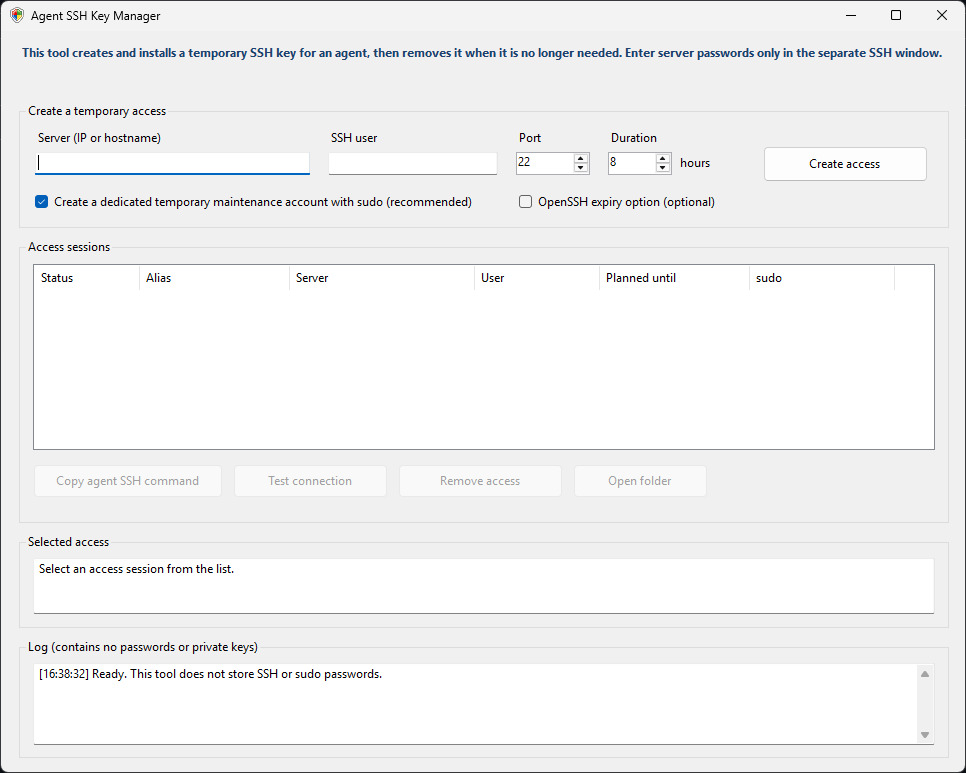

# Agent SSH Key Manager

[](https://github.com/svenreischauer/AgentSshKeyManager)
[](LICENSE)
[](https://github.com/svenreischauer/AgentSshKeyManager/releases)
[](https://github.com/svenreischauer/AgentSshKeyManager/stargazers)

Agent SSH Manager is a portable Windows tool for creating, installing, and removing temporary SSH keys for AI agents (e.g., Claude Code) on Ubuntu servers.
Administer remote servers by AI agents is convenient however, you want to do it without sharing your ssh credentials. With Agent SSH Manager, you can generate temporary SSH keys for your agent, granting them sudo access to the server without exposing your personal credentials.

Download the latest [`AgentSshKeyManager.exe`](https://github.com/svenreischauer/AgentSshKeyManager/releases/latest/download/AgentSshKeyManager.exe) from the Releases page. It requires no installer and uses the Windows OpenSSH client.

## Screenshot



## What it does

- Generates a separate Ed25519 key for every access session.
- Opens a separate SSH window for entering SSH and sudo passwords. Passwords are never entered into, stored by, or logged by the application.
- Starts the Windows OpenSSH client directly; it does not generate or invoke PowerShell scripts to perform SSH operations.
- Installs the public key either for the existing SSH user or for a dedicated temporary Linux account.
- Creates an SSH configuration that disables password and keyboard-interactive authentication for the agent connection.
- Disables SSH agent, port, and X11 forwarding for the installed key.
- Tests the key before marking the access as active.
- Removes the server-side key and deletes the local private key when access is removed successfully.

The temporary private key grants access to the server while it is active. Do not paste the private key into chat, email, or tickets.

## Recommended mode: temporary account with sudo

The dedicated temporary account option is enabled by default. The tool creates a randomly named Linux account such as `agentssh_a1b2c3d4e5`, installs the public key, and adds a `visudo`-validated passwordless sudo rule for that account.

Removing the access stops processes owned by the temporary account and deletes its key, sudo rule, root-owned session marker, home directory, and user account. The marker under `/var/lib/agent-ssh-key-manager` prevents a corrupt session record from reusing or deleting an unrelated pre-existing account.

This mode gives the temporary account full administrator rights. Use it only on systems where you are authorized to do so, and only for the required duration.

## Existing-user mode

If the dedicated-account option is disabled, the tool adds the temporary key to the selected user's `~/.ssh/authorized_keys` file. The user's existing sudo configuration is not changed. If sudo requires a password, unattended administrative commands will not work in this mode.

## Usage

1. Start `AgentSshKeyManager.exe`.
2. Enter the server address, SSH user, port, and planned duration.
3. Click **Create access**.
4. Verify the server fingerprint against a trusted source before accepting it.
5. Enter the SSH and, when requested, sudo passwords in the separate window.
6. Select the active session and click **Copy agent SSH command**.
7. Paste only that command into the agent task.
8. When the work is finished, select the session and click **Remove access**.

The clipboard is used only when **Copy agent SSH command** is clicked. The application never copies anything automatically.

An agent SSH command looks like this:

```text
ssh.exe -F "C:\...\ssh_config" agent-ssh-a1b2c3d4e5
```

## Expiry and removal

The planned duration is a local reminder unless **OpenSSH expiry option** is enabled. The optional server-side expiry blocks new logins after the expiry time, but it does not terminate an already open SSH session. Always remove the access when the work is complete.

If the server rejects the optional expiry setting, the tool can retry without it. The access must then be removed manually.

## Local data

Session data is stored in:

```text
%LOCALAPPDATA%\AgentSshKeyManager\Sessions
```

Private keys have no passphrase so an agent can use them unattended. The application restricts their NTFS permissions to the current Windows user and `SYSTEM`. After confirmed removal, secret local files are deleted; non-secret session metadata remains as a local record.

Each session also has an `interactive-actions.log` audit file containing timestamps, process IDs, executable and payload hashes, and exit codes. It does not contain passwords, private keys, or the raw remote command. Detailed SSH authentication and sudo errors remain visible in the separate console until you press ENTER; they are intentionally not redirected into the audit file because doing so could interfere with interactive prompts.

## Requirements

- Windows 10 or 11
- Windows OpenSSH Client optional feature
- An Ubuntu server with OpenSSH
- An authorized SSH user; sudo rights are required for the dedicated-account mode
- Network access to the SSH port

## Build, signing, and self-test

The build has two explicit modes. For local development, create a clearly marked unsigned executable:

```powershell
powershell.exe -NoProfile -ExecutionPolicy Bypass -File .\Build.ps1 -UnsignedDevelopmentBuild
```

Each development build gets a fresh `dist\dev-unsigned-*` directory and the filename `AgentSshKeyManager-UNSIGNED-DEVELOPMENT.exe`. The build runs the executable's local self-test and writes a matching `.sha256` file. Never publish this artifact as an official release.

For a signed production release, supply a semantic version and the thumbprint of an Authenticode code-signing certificate exposed in the current user's certificate store:

```powershell
powershell.exe -NoProfile -ExecutionPolicy Bypass -File .\Build.ps1 `
    -ReleaseVersion 1.1.0 `
    -CertificateThumbprint 'YOUR_CERTIFICATE_THUMBPRINT'
```

If `signtool.exe` is not on `PATH`, add `-SignToolPath 'C:\Program Files (x86)\Windows Kits\10\bin\<SDK-version>\x64\signtool.exe'`.

A successful release build creates exactly these publishable files in a new versioned directory:

```text
dist\v1.1.0\AgentSshKeyManager.exe
dist\v1.1.0\AgentSshKeyManager.exe.sha256
```

The version is written into the executable and application manifest. The build signs once with SHA-256 and an RFC 3161 timestamp, verifies the signature and timestamp, runs the staged executable's self-test, computes the checksum from the signed bytes, and only then publishes the complete directory. It refuses to overwrite an existing version directory.

To run the development self-test again, use the path printed by the build or select the newest development artifact:

```powershell
$developmentBuild = Get-ChildItem .\dist\dev-unsigned-*\AgentSshKeyManager-UNSIGNED-DEVELOPMENT.exe |
    Sort-Object LastWriteTimeUtc -Descending |
    Select-Object -First 1
$report = "$env:TEMP\AgentSshKeyManager-test.txt"
$process = Start-Process -FilePath $developmentBuild.FullName `
    -ArgumentList @('--self-test', ('"' + $report + '"')) `
    -Wait -PassThru
if ($process.ExitCode -ne 0) { throw "Self-test failed: $($process.ExitCode)" }
Get-Content -LiteralPath $report
```

The self-test validates local key generation, persisted-session and public-key safeguards, the constrained same-executable child and system-OpenSSH launch paths, Windows argument transport, expiry generation, and remote install/removal command construction. It does not connect to a server or automate the interactive console/password flow.

Before treating a build as release-ready, run Create, key verification, and Remove against an authorized disposable Ubuntu host. Test both the dedicated-account and existing-user modes, with and without server-side expiry. Confirm that removal rejects the key and, for dedicated mode, removes the temporary user, home directory, processes, `/etc/sudoers.d` entry, and `/var/lib/agent-ssh-key-manager/*.owner` marker. Also test a wrong password or cancelled SSH window and confirm that the main GUI survives and the console keeps the error visible until ENTER. Finally, repeat Create and Remove under the intended Sophos policy and check both local events and Sophos Central for a new detection.

`-ExecutionPolicy Bypass` applies only to this local build script on systems whose PowerShell policy blocks unsigned scripts. The application itself does not launch PowerShell or use an execution-policy bypass.

See [Code signing and releases](docs/CODE_SIGNING.md) for SignTool installation, certificate constraints, artifact verification, and the release checklist.
